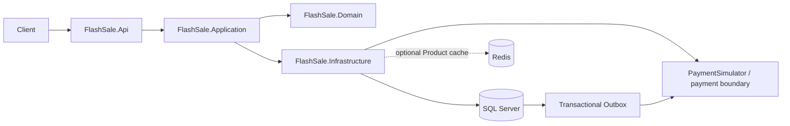

# Architecture

## Boundaries

Domain owns business state, invariants, and transitions, organized into `Orders`, `Products`, and `Inventory`. It has no project or framework dependencies.

Application owns use-case orchestration. `Orders/CreateOrder/CreateOrderHandler` validates commands, fingerprints requests, resolves idempotent replays, loads catalog prices, and creates the aggregate. `Orders/GetOrder/GetOrderHandler` produces the order projection. `Payments/ProcessOrderPayment/ProcessOrderPaymentHandler` chooses pay or close, interprets the outcome, and applies domain transitions and the inventory-release decision.

Infrastructure implements SQL persistence, inventory concurrency, payment Outbox persistence and hosting, and external HTTP communication. API owns HTTP contracts, header parsing, routing, status codes, and Problem Details. Endpoints manually map `Contracts/Orders/CreateOrderRequest` to `CreateOrderCommand` and application results to `OrderResponse`.

Project references flow `Api → Infrastructure → Application → Domain`. The simulator is independent. Infrastructure's root registration composes persistence, inventory, Outbox, payments, and the application handlers; Application needs no DI or configuration package.

There are four application ports:

- `Orders/CreateOrder/IOrderCreationStore`: catalog/key reads and an atomic order, reservation, and payment-work commit. A duplicate commit returns the winning order; Application checks its fingerprint.
- `Orders/GetOrder/IOrderReader`: an untracked aggregate read shared by order queries and payment processing.
- `Payments/ProcessOrderPayment/IOrderPaymentCompletion`: invokes the application's synchronous transition against the exclusively locked current order, then atomically persists state, requested inventory compensation, and Outbox completion.
- `Payments/Contracts/IPaymentGateway`: pay/close operations independent of HTTP.

## Runtime shape

SQL Server remains authoritative. Redis is a bounded cache-aside optimization for Product metadata only; cache failures fall back to SQL. The checkout path reads authoritative Product prices from SQL.

The completion callback keeps decisions inside Application without exposing SQL transactions or holding a database lock during HTTP. Its boolean return requests inventory compensation. Infrastructure uses EF directly; there is no generic repository, unit-of-work wrapper, or interface for each implementation.

Order is the aggregate root. Items carry immutable quantity and price snapshots. Inventory is independent and is mutated only through conditional reservations and terminal-order compensation. Products have no management API in this release. Money uses two decimal places in a single implicit currency.

The simulator owns a separate SQL database and no FlashSale project references. Its payment ledger is the authority for an operation's terminal outcome. The order ID is also the stable payment operation ID.

## Transaction boundaries

After Application validation and catalog reads, `Infrastructure/Orders/Persistence/SqlOrderCreationStore.CommitAsync` runs at SQL Server's default read-committed isolation:

1. Insert the Pending order and items, claiming the unique `(UserId, IdempotencyKey)` index.
2. For each product in stable order, conditionally decrement stock where sufficient quantity remains.
3. Insert one Outbox record and commit.

The early order insert prevents an in-flight duplicate from competing for stock. It is invisible until commit. A duplicate-key exception rolls back before loading the winning order. A request hash rejects reuse with different products or quantities; item ordering does not affect identity. Every reservation and insert rolls back on failure.

`Infrastructure/Orders/Persistence/SqlOrderPaymentCompletion` takes an `UPDLOCK, HOLDLOCK` on the order row before invoking the Application transition. It releases stock when requested and marks the Outbox record processed in the same transaction. The release flag and terminal state are persisted together, with a check constraint requiring unsuccessful orders to have released inventory. `Infrastructure/Inventory/SqlInventoryReservation` owns the conditional SQL updates and stable product ordering that reduces deadlocks.

Remote HTTP is outside both transactions. A cancelled response or ambiguous local commit is recovered by request or payment idempotency.

## Asynchronous processing

`Infrastructure/Outbox/Persistence/OrderPaymentOutboxMessage` is a durable payment work item referencing immutable order data. It deliberately supports only order payments; no serialized event framework is involved. The existing SQL table remains `OutboxMessages`. `SqlPaymentOutboxStore` atomically claims work using an expiring lease and unique claim token. Scheduling and leases use the database clock. `UPDLOCK`, `READPAST`, and `READCOMMITTEDLOCK` allow competing workers to claim eligible work, including databases using read-committed snapshot isolation. `Outbox/Processing/OutboxWorker` creates a fresh DI scope and DbContext each iteration; `PaymentOutboxProcessor` claims work, invokes the Application payment handler, and schedules durable retries.

Before the deadline, the worker calls `POST /payments`. At or after it, the worker calls `POST /payments/close`. This same persisted work item drives expiration; there is no second timer process that could independently release stock. Provider resolution and local completion can repeat after a crash or lease expiry. Claim tokens fence retry scheduling; the terminal order lock prevents duplicate compensation even for a stale worker.

HTTP retries are bounded per processing attempt. Unresolved work receives durable exponential backoff, capped at 60 seconds, and remains eligible after restart. No delivery or processing step claims exactly-once semantics.

The claim query uses the filtered `(NextAttemptAt, Id)` index and includes lease and order fields so due work can be found in order without a candidate sort. Inventory reservation uses one parameterized SQL batch for a multi-item order while retaining ordered conditional updates and the surrounding transaction. The batch reduces database round trips but can increase logical reads within one command.

## Payment and expiration

The simulator serializes pay/close for each operation with a SQL key-range update lock. It persists exactly one terminal ledger record: Paid, Rejected, or Cancelled. Amount and expiry must match on every replay. Close creates a cancellation tombstone if no operation exists; a later payment cannot replace it. If payment wins first, close returns Paid and inventory remains consumed.

`charge-then-delay` commits Paid before delaying the first response; replay returns the recorded outcome immediately. `reject` records a business rejection. `unavailable` returns 503 before accepting payment; close remains available in that scenario. A stopped/unreachable simulator also makes close unavailable.

`Infrastructure/Payments/Http/PaymentGatewayHttpClient` implements the gateway. `Payments/Resilience/PaymentResilienceExtensions.cs` exposes the total timeout, attempt timeout, retry count, exponential backoff, jitter, circuit breaker, and standard transient-failure predicate. Settings live beside it in `PaymentResilienceOptions.cs`, nested under `PaymentOptions.Resilience`. `Payments/DependencyInjection.cs` adds this pipeline and then the response-buffering handler so body reads remain inside the timeout. The pipeline limits bodies to 64 KiB and propagates cancellation. An ambiguous response never triggers inventory release. Permanent business rejection leads to Failed; confirmed cancellation after the reservation deadline leads to Expired. Paid cannot transition to Failed or Expired.

The simulator keeps its own request/response contracts and `PaymentOutcome` intentionally: it represents an independent external HTTP system. `Payments/PaymentProcessor` implements scenarios; `Persistence/SqlPaymentLedger` owns pay/close serialization. There is no shared contract project. Historical migration target models retain their original CLR names; the current snapshot follows the new namespaces without changing SQL tables or constraints.

## Runtime assumptions

- SQL Server is the consistency boundary for every application replica. Leases reduce duplicate work but are not the correctness mechanism.
- The provider must retain terminal payment/cancellation identities for at least as long as requests and messages can be replayed. A real provider integration must offer equivalent fencing, or add refund/reconciliation handling before releasing ambiguous payments.
- Hosts and databases need reasonably synchronized UTC clocks. Clock skew can delay completion; it cannot overwrite a provider terminal result.
- Expiration is eventual and depends on provider and database recovery. Under sustained outage, preserving payment correctness takes priority over releasing inventory.
- The API currently accepts client-supplied user IDs and has no authorization. Bind to loopback for local use; identity and order-access controls are required before public exposure.
- Outbox and payment records are retained. Retention, operational alerting, and automated handling of persistently invalid provider responses remain future operational work.

